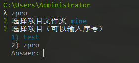
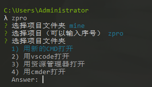

# zpro 

cmd中的项目管理工具

注：仅在windows中使用， 未经mac测试过

## 安装

`npm install -g zpro`

## 运行

`zpro`

初始时需要配置一个默认的项目路径（只需第一次输入）


有了项目之后， 就可以选择项目， 并且进行项目管理了





## 命令列表

```
zpro list|ls                                  查看项目文件目录
zpro add <key> <dir>                          添加文件夹地址
remove <key>                                  移除文件夹地址
command                                       查看操作命令列表
set-command <key> <command> <description>     设置操作命令
del-command <key>                              设置操作命令
```